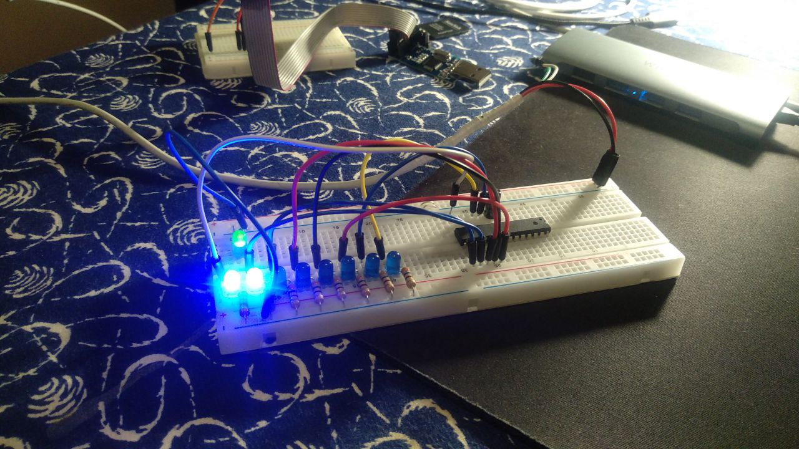

## CMake-avr

This repository represents an example of setting up
an avr programming workflow with CMake build tool. 
Right now this repository contains blinker example. 
It shows how to use static library `blink` with the 
main `blinker` executable, making the executable
as small as possible at the time.

User can change the build essentials at the top of [CMakeLists.txt][cmkaelists] with next variables:

Option | Description | Default value |
--- | --- | --
|`PROG_TYPE`| Programator type. Used by `avrdude`. | `usbasp` |
|`MCU` | Chip type. Used by the compiler and `avrdude`. | `atmega168a`|
|`F_CPU`| Chip frequency. Used by compiler. | `1000000` |
|`BAUD`| BAUD rate. Used by UART protocol. |`9600` |

The [CMakeLists.txt][cmkaelists] contains definitions for main executable `blinker` and some custom targets:
- _strip_ interface for `avr-strip`
- _hex_ interface for `avr-objcopy` .hex generation
- _eeprom_ target to write eeprom to chip with `avr-objcopy`
- _flash_ the `avrdude` link
- _noflash_ the `avrdude` interface but with `-n` option (no instructions sent to chip)
- _size_ calls the `avr-size` utility

Note that You need to tell `cmake` where to find toolchain file at configure stage with
```
cmake -DCMAKE_TOOLCHAIN_FILE=avr.toolchain.cmake -B build
```
CMake 3.21 or later supports `--toolchain` option: 
```
cmake --toolchain avr.toolchain.cmake -B build
```
---


Happy avr programming!

[cmkaelists]: https://github.com/Dolfost/avr-cmake/blob/main/CMakeLists.txt
